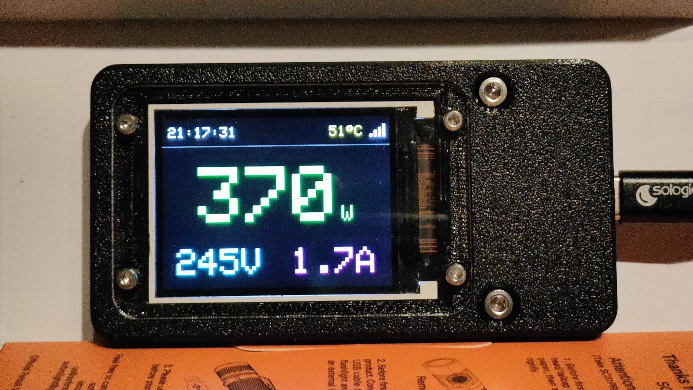

# ESP32-C3 Fox Energy Power Monitor Display



## Description

This project utilizes an ESP32-C3 microcontroller and an ST7789 TFT display to create a real-time energy monitor. It connects to a local Wi-Fi network, fetches power metrics (Voltage, Current, Active Power) from a Fox Energy1 HTTP REST API endpoint, and displays the data along with the current time (synced via NTP), internal chip temperature, and Wi-Fi signal strength.

Energy meter used: [1-phase energy consumption monitor wi-fi ENERGY-1](https://www.fif.com.pl/en/fox-wi-fi-control/1448-1-phase-energy-consumption-monitor-wi-fi-energy-1.html)

## Features

## Hardware Requirements

*   **Power meter:** Fox Energy 1 single-phase energy consumption monitor
*   **Microcontroller:** ESP32-C3 Super Mini
*   **Display:** 2.0 ST7789 TFT/IPS SPI Display (240x320)
*   **Wiring:** Connect the ST7789 display to the ESP32-C3 using SPI:
    *   TFT `CS` -> ESP32-C3 `GPIO7` (Default SPI SS)
    *   TFT `DC` -> ESP32-C3 `GPIO2` (or another unused GPIO Pin)
    *   TFT `RST` -> ESP32-C3 `GPIO3` (or another unused GPIO Pin)
    *   TFT `SDA`/`MOSI` -> ESP32-C3 `GPIO6` (Default SPI MOSI)
    *   TFT `SCL`/`SCK` -> ESP32-C3 `GPIO4` (Default SPI SCK)
    *   TFT `GND` -> ESP32-C3 `GND`
    *   TFT `VCC` -> ESP32-C3 `3V3`

## Software Dependencies

*   **Arduino IDE** configured for ESP32 development.
*   **ESP32 Board Support Package**.
*   **Required Libraries:**
    *   `Adafruit GFX Library`
    *   `Adafruit ST7789 and ST7735 Library`
    *   `ArduinoJson` (by Benoit Blanchon)
    *   `WiFi` (usually included with ESP32 core)
    *   `HTTPClient` (usually included with ESP32 core)
    *   `Time` (usually included with ESP32 core)

## Configuration (v3)

Before uploading, configure secrets.h and set the SSID/password for WIFI and FOX Energy API endpoint.

Other config options are in config.h.

## Configuration (v1/v2)

Before uploading, configure the settings within the desired `.ino` file (e.g., `fox_energy1_st7789_display_v2.ino`):

1.  **WiFi Credentials:**
    ```cpp
    const char* ssid     = "YOUR_WIFI_SSID";
    const char* password = "YOUR_WIFI_PASSWORD";
    ```
2.  **API URL:**
    ```cpp
    const char* dataUrl  = "http://FOX_ENERGY1_IP_ADDRESS/0000/get_current_parameters";
    ```
3.  **Display Pins:** Verify the `#define` statements for `TFT_CS`, `TFT_RST`, `TFT_DC` match your wiring.
4.  **Timezone:** Adjust `gmtOffset_sec` and `daylightOffset_sec` if necessary.

## Files Overview

*   **`fox_energy1_st7789_display_v3.ino`:** Current stable, reworked code with flicker-free display. Recommended starting point.
*   **`kde_plasma_6_widget/com.local.foxenergy1monitor`:** KDE Plasma 6 widget

Other version for testing purposes:

*   **`fox_energy1_st7789_display_v2.ino`:** Previous stable, feature-complete version, featuring NTP time, temperature, dynamic power colors, and flicker reduction.
*   **`fox_energy1_st7789_display_v1.ino`:** An earlier version of the display logic.
*   **`claude_fox_horizontal.ino` / `claude_fox_pivot.ino`:** Versions exploring different display orientations (horizontal/vertical) and UI.
*   **`gemini_fox.ino`:** Yet another earlier version of the display logic.

Debug:

*   **`display_test.ino`:** A simple sketch to test the basic functionality of the ST7789 display.
*   **`wifi_debug_http_send.ino`:** A utility sketch to send diagnostic data (RSSI, heap, uptime) over HTTP, for debugging purposes.

## Setup and Usage

1.  Install the Arduino IDE.
2.  Install the required ESP32 board support package.
3.  Install the necessary libraries mentioned under "Software Dependencies".
4.  Connect the ST7789 display to your ESP32-C3 board according to the wiring section (verify pins in the chosen `.ino` file).
5.  Open the desired `.ino` file (e.g., `fox_energy1_st7789_display_v2.ino`).
6.  Modify the WiFi credentials and API URL in the configuration section.
7.  Select the correct ESP32-C3 board and port in your IDE.
8.  Compile and upload the sketch to the ESP32-C3.
9.  The display should initialize, connect to Wi-Fi, sync time, and start showing energy data.

## License

Public Domain / CC0 1.0 Universal

## Authors

AI models used:

- v2 - Gemini 2.5 Pro Preview 03-25
- v3 - Claude Sonnet 4.5 (Thinking) + Gemini 3 Pro (High)
